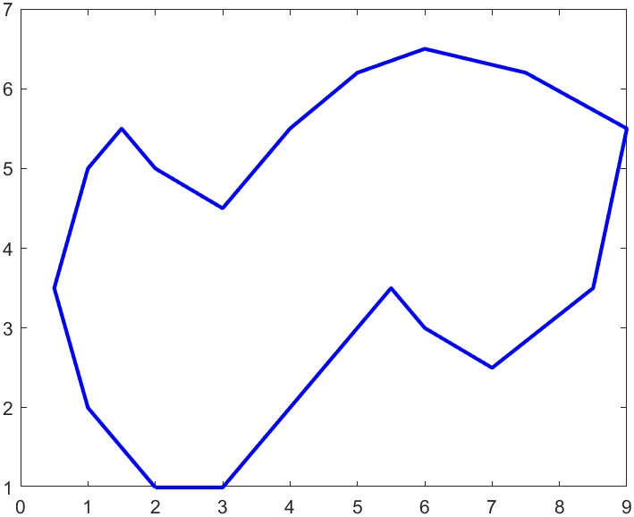

<body>
    <h1>Computational Fluid Dynamics Project: 2D Triangulation</h1>
    
This course project explores the use of Computational Fluid Dynamics (CFD) techniques for simulating physical systems. We delved into a specific area of CFD known as triangulation, focusing on the advancing front method.

    <h2>Triangulation of Arbitrary Shapes</h2>
    
The project involved developing code to perform triangulation using the advancing front method on any 2D shape. The code requires a limited number of coordinates to define the shape.

    
For example, consider an arbitrary shape like this:

    
    <h2>Triangulation Visualization </h2>
    
Upon running the code, the triangulation of the given shape would be a series of interconnected triangles that approximate the original shape's boundary. These triangles would form a mesh suitable for further CFD calculations.

    
Here's a video demonstrating the triangulation process for a similar shape:

    <video width="560" height="315" controls>
    <source src="Pics/AFM Triangulation.mp4" type="video/mp4">
    Your browser does not support the video tag.
    </video>
    <h2>Key Points</h2>
    <ul>
        <li>The advancing front method is an efficient algorithm for 2D triangulation.</li>
        <li>The code requires a minimal set of coordinates to define the shape.</li>
        <li>The resulting triangulation mesh is useful for CFD simulations.</li>
    </ul>
    <h2>Future Work</h2>
    
(Optional) Briefly discuss potential areas for improvement or expansion on this project.

    
This project serves as a foundational step in understanding and applying triangulation for CFD applications. Further exploration could involve:

    <ul>
        <li>Extending the code to handle 3D shapes.</li>
        <li>Integrating the triangulation mesh into a CFD software package.</li>
        <li>Experimenting with different triangulation algorithms for specific CFD needs.</li>
    </ul>

</body>
