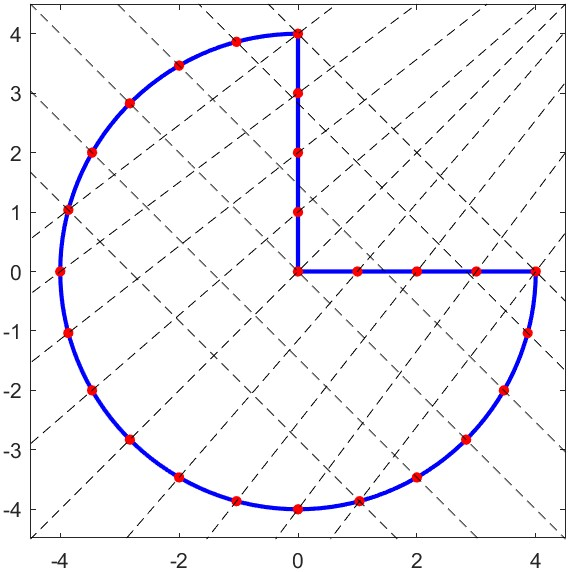

# Part 1 : 2D Triangulation using AFM and Delaunay Triangulation
  This course project explores the application of Computational Fluid Dynamics (CFD) techniques, specifically focusing on triangulation using the advancing front method for 2D shapes along with delaunay Triangulation .
> Both of these techniques are unstructured grid generation techniques
## Triangulation of Arbitrary Shapes
The project involved developing code to perform triangulation on any 2D shape using the advancing front method. The code requires only a minimal set of coordinates to define the shape's boundary.

For example, consider an arbitrary shape like this:

## Advancing Front Method and Delaunay Triangulation Implementation 
 >  Refer to the file *Final_Call.m* which serves as the main file where all the functions are called.
- Begin by defining the coordinates of the boundary points (*done in anticlockwise manner in this project*)
- Specify n as the number of triangulations 
- Next we proceed with generation of continous boundary from the above available discrete points on the boundary by calling the function *boundary_generation.m* 
- Also the area of the shape is found by calling *area.m* which makes use of Shoelace formula for calculating area of a polygon
- we now have our shape same as the one in above image
- Next we proceed with exterior boundary nodalization as in the file *boundary_nodalization.m* to obtain the shape as 
- Now we head towards interior node generation by making use of the function *interior_nodalization* to get 
- Thus finally we proceed to triangulation using the respective functions *AFM.m* and *Delaunay.m* 

> AFM.m is full written code while Delaunay.m file makes use of built in MATLAB function delaunayTriangulation .

## Triangulation Visualization
Upon running the code, the triangulation of the given shape would be a series of interconnected triangles that approximate the original shape's boundary. These triangles form a mesh suitable for further CFD calculations.
- Using AFM Triangulation 
 
 https://github.com/Amokmac07/Computational-Fluid-Dynamics/assets/160387852/bee25fe9-cbc7-40f8-90a5-146c0287a33f
 
- Using Delaunay Triangulation

## Key Points
- The advancing front method provides an efficient approach for 2D triangulation.
- The code requires a small number of coordinates to define the shape.
- The resulting triangulation mesh serves as the foundation for CFD simulations.

# Part 2 : Triangulation using Algebraic Transfinite Interpolation 
    Algebraic Tranfinite Interpolation is a type of structured grid approach for triangulation .  

If we want to solve equation 
and the shape under consideration is as follows
   
   
## Implementing the method to above shape 

 
 - Begin by plotting the shape and also divide the external boundary into nodes as per the question to get 
 
 
 - Join the nodes to get the grids and also find the intersection points to get as follows 
 

 - The next step is to map the shape in the computational plane having the same number of nodes , we get 
 

 - First we interpolate along the $eta$ direction to get the grids in the physical plane as 
 
 - Then finally we get the shifted grids in the physical plane by interploating along the $xi$  direction to get\
 
- Then we calculate the metrics of transformation at each gridpoint which inturn will help to find the coefficients in the equation 
